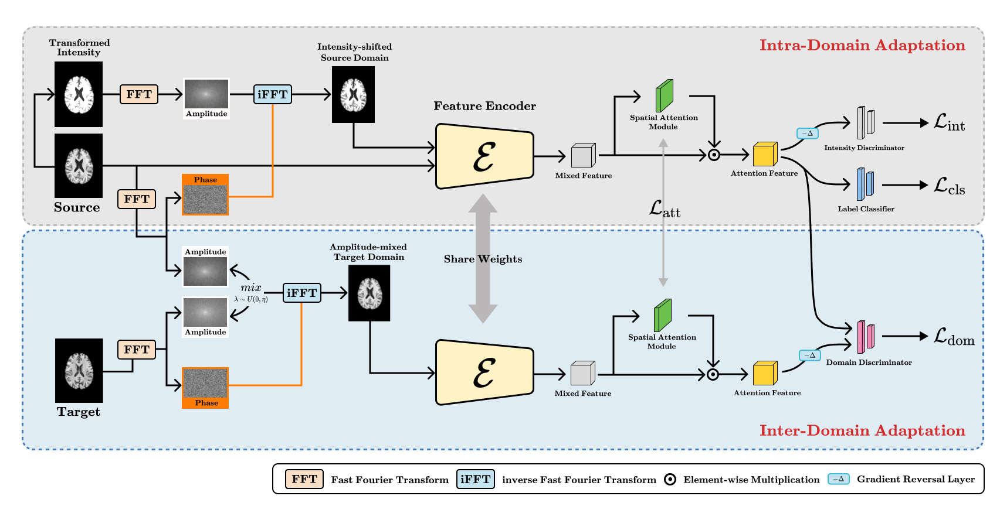

# Frequency Mixup Manipulation based Unsupervised Domain Adaptation for Brain Disease Identification

[ACPR 2023 Oral Accepted]
## Overview


Unsupervised Domain Adaptation (UDA), which transfers the learned knowledge from a labeled source domain to an unlabeled target domain, has been widely utilized in various medical image analysis approaches. Recent advances in UDA have shown that manipulating the frequency domain between source and target distributions can significantly alleviate the domain shift problem. However, a potential drawback of these methods is the loss of semantic information in the low-frequency spectrum, which can make it difficult to consider semantic information across the entire frequency spectrum. To deal with this problem, we propose a frequency mixup manipulation that utilizes the overall semantic information of the frequency spectrum in brain disease identification. In the first step, we perform self-adversarial disentangling based on frequency manipulation to pretrain the model for intensity-invariant feature extraction. Then, we effectively align the distributions of both the source and target domains by using mixed-frequency domains. In the extensive experiments using the ADNI dataset, our proposed method achieved outstanding performance over other UDA-based approaches in medical image classification

## Setup

- Python 3.7.10
- CUDA Version 11.0

1. Nvidia driver, CUDA toolkit 11.0, install Anaconda.

2. Install pytorch
```
conda install pytorch torchvision cudatoolkit=11.0 -c pytorch
```

3. Install various necessary packages

```
pip install scikit-learn numpy torchio tqdm
```

## Training

When using Terminal, directly execute the code below after setting the path

Intra-Domain Adaptation Step

```
python train_intra_DA.py --gpu 0 --model_name custom_name --batch_size 4 --init_lr 1e-4 --epochs 50
```

Inter-Domain Adaptation Step

```
python train_inter_DA.py --gpu 0 --model_name custom_name --batch_size 4 --init_lr 1e-4 --epochs 100 --source adni1 --target adni2
```


## Evaluting

You can use the model used for training earlier, or you can evaluate it by specifying the model in --model_name

```
python test_inference.py --gpu 0 --model_name trained_model --batch_size 1 --test_target adni2
```
